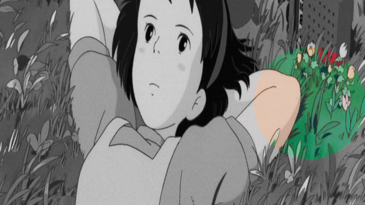
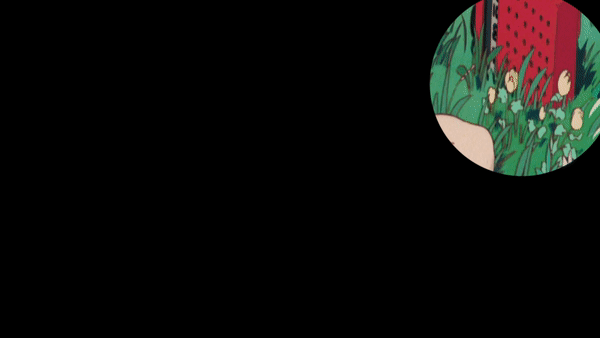
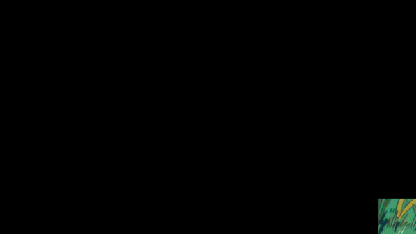
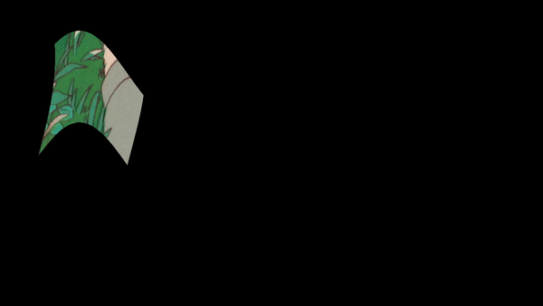
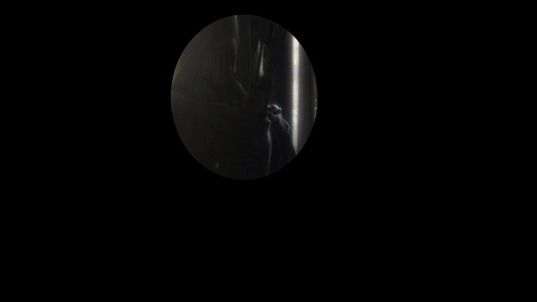

# 🎭 WebGL Masks

A set of masking effect demos with WebGL(OGL) and shaders.

### Installation

```bash
# Clone the repo on you local machine
git clone git@github.com:deepak-gangwar/webgl-mask.git

# To install dependencies
npm install

# To start a dev server locally
npm run dev

# To build the project (output in public folder)
npm run build
```

### ✌ Masks

> Following are mentioned masks with their commits and demo gifs.
> To try any one of them, check code of the respective commit.

#### Mask 1

<br />
<br />


#### Mask 2

<br />
<br />



#### Mask 3

<br />
<br />



#### Mask 4

<br />
<br />



#### Mask 5

<br />
<br />



#### Mask 6

<br />
<br />


